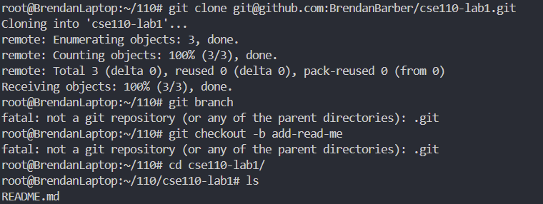
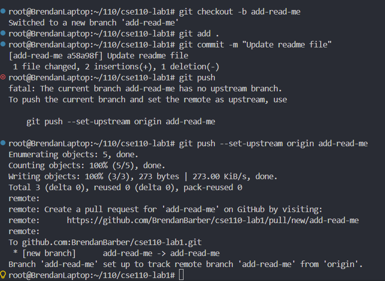

# Brendan Barber

Hello! My name is **Brendan** and I am interested in graphics programming.

*I love bridging the gap between artistic vision and technical implementation, whether that's building VFX tools for artists or creating video games. When I'm not coding, you'll find me practicing violin, playing casual ice hockey, or getting lost in a good book.*

---

## Lists of stuff

Some books I am reading:
- "Dune" by Frank Herbert 
- "Salt Sugar Fat" by Michael Moss

Some games I am playing:
- ~~Silksong~~
- Hytale
- Kingdom Come Deliverance II

Favorite foods:
1. California Burrito
2. Smash Burger
3. Sushi (Philidelphia Roll)

### Checklist

Things I got to do today:
- [x] Wake up
- [x] Do this assignment
- [ ] Eat lunch
- [ ] Go to sleep

---

> Here is some code

```C++
void Camera::look_at(const glm::vec3& target, const glm::vec3& up) {
    m_forward = glm::normalize(target - m_pos);
    m_right = glm::normalize(glm::cross(m_forward, up));
    m_up = glm::normalize(glm::cross(m_right, m_forward));
}
```

For more information on my work: [Click here](https://brendanbarber.github.io/Portfolio/projects/)

---

Here are some screenshots of my git commands from this lab:






And then for the VSCode UI commit:
[Committing a .gitignore](Part2-3.png)

[Jump to top](#brendan-barber)